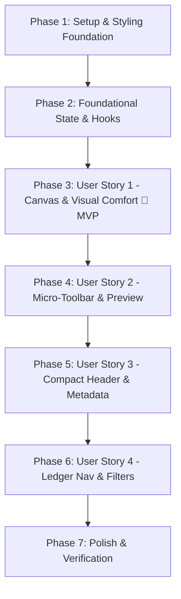

# Tasks: Local Editor Visual Redesign & Writing Comfort Refactor

**Input**: Design documents from `/specs/001-editor-visual-redesign/`
**Prerequisites**: `plan.md`, `spec.md`, `research.md`, `data-model.md`, `contracts/`, `quickstart.md`
**Tests**: Vitest tests defending pure state reducers, vocabulary aggregators, and markdown formatting utilities.

**Organization**: Tasks are grouped by user story (P1, P2, P3) to enable independent implementation and testing.

## Format: `- [ ] [TaskID] [P?] [Story?] Description with file path`

- **[P]**: Can run in parallel (different files, no dependencies)
- **[Story]**: Which user story this task belongs to (`US1`, `US2`, `US3`, `US4`)
- Exact file paths included in every task

---

## Phase 1: Setup & Styling Foundation

**Purpose**: Establish warm paper tokens, retro grid background, and pure helper utilities.

- [X] T001 Refactor `src/dev/editor.css` to define warm craft paper tokens (`--paper`, `--paper-dark`, `--paper-cotton`, `--board-kraft`), subtle `24px x 24px` drafting grid, and base Neo-Brutalist element resets.
- [X] T002 [P] Implement Markdown selection formatting and cursor handling helpers in `src/dev/lib/markdown-actions.ts`.
- [X] T003 [P] Implement true-to-site Article Binder HTML document synthesis helper in `src/dev/lib/preview-renderer.ts`.

---

## Phase 2: Foundational State & Hooks

**Purpose**: Core state reducers, custom hooks, and helpers that all user stories depend on.

- [X] T004 [P] Extend workspace state reducer in `src/dev/editor-state.ts` to support sidebar collapse, metadata collapse toggle, and view modes, updating unit tests in `tests/dev/editor-state.test.ts`.
- [X] T005 [P] Implement keyboard shortcuts and indentation hook in `src/dev/hooks/useEditorShortcuts.ts` (`Ctrl/Cmd+S`, `Ctrl+B`, `Ctrl+I`, `Ctrl+K`, `Ctrl+E`, `Tab`, `Shift+Tab`).
- [X] T006 [P] Implement 300ms debounced live preview hook in `src/dev/hooks/useDebouncedPreview.ts`.
- [X] T007 [P] Implement in-memory vocabulary aggregator hook in `src/dev/hooks/useGardenVocabulary.ts` (extracting unique tags and categories).

---

## Phase 3: User Story 1 - Comfortable Short-Entry Writing Canvas (Priority: P1) 🎯 MVP

**Goal**: Deliver an eye-friendly, comfortable writing canvas with warm paper tones, generous vertical space, and clear visual hierarchy.

**Independent Test**: Launch editor, open any entry, and verify that the writing canvas is prominent, eye-friendly with warm paper background, and unobstructed by long lists of metadata inputs.

- [X] T008 [P] [US1] Implement the top application header in `src/dev/components/StudioToolbar.tsx` (brand badge, loopback status, entry count, view toggles, new entry button, save button with status).
- [X] T009 [US1] Create the core editing canvas layout in `src/dev/editor.tsx` and `src/dev/editor.css` providing full-height writing space with warm paper styling.
- [X] T010 [US1] Verify visual comfort and responsive canvas layout across desktop viewport sizes per User Story 1 acceptance scenarios.

**Checkpoint**: At this point, User Story 1 delivers an eye-friendly writing environment with generous vertical height.

---

## Phase 4: User Story 2 - Lightweight Markdown Micro-Toolbar & Live Binder Preview (Priority: P1)

**Goal**: Provide single-row micro-toolbar for essential formatting, tab indentation, shortcuts, and 300ms debounced live article binder preview.

**Independent Test**: Type Markdown with micro-toolbar actions and shortcuts (e.g. bold, link, code), see instant debounced rendering in the preview pane, and confirm that the preview matches the published site layout.

- [X] T011 [P] [US2] Implement the single-row formatting toolbar in `src/dev/components/MarkdownToolbar.tsx` with buttons for bold, italic, code, link, quote, lists, code block, and live word/reading time statistics.
- [X] T012 [P] [US2] Implement the live sandboxed article binder preview pane in `src/dev/components/ArticleBinderPreview.tsx` using `buildPreviewDocument` with `.article-content` styling.
- [X] T013 [US2] Wire `MarkdownToolbar`, `useEditorShortcuts`, and `ArticleBinderPreview` into `src/dev/editor.tsx`.
- [X] T014 [US2] Verify formatting shortcuts, micro-toolbar clicks, tab indenting, and debounced preview rendering per User Story 2 acceptance scenarios.

**Checkpoint**: User Stories 1 AND 2 work together, providing an ergonomic Markdown authoring experience with live true-to-site preview.

---

## Phase 5: User Story 3 - Compact Collapsible Header & Vocabulary Autocomplete (Priority: P2)

**Goal**: Provide compact collapsible header for metadata and autocomplete for tags and categories.

**Independent Test**: Expand the compact header's advanced properties, type a tag prefix to see suggestions from existing entries across the garden, select related entries via an interactive selector, and use quick "today" actions for date updates.

- [X] T015 [P] [US3] Implement the interactive tag chip picker with autocomplete suggestions in `src/dev/components/controls/TagPicker.tsx`.
- [X] T016 [P] [US3] Implement the external links repeater control in `src/dev/components/controls/LinkRepeater.tsx`.
- [X] T017 [P] [US3] Implement the related entries selector control in `src/dev/components/controls/RelatedPicker.tsx`.
- [X] T018 [US3] Implement the compact collapsible header in `src/dev/components/CompactHeader.tsx` (primary row for Title/Slug/Draft toggle, expandable drawer for Summary/Tags/Category/Dates/Links/Related with "今天" quick fill).
- [X] T019 [US3] Integrate `CompactHeader` into `src/dev/editor.tsx`.
- [X] T020 [US3] Verify metadata collapse/expand, tag autocompletion, and quick date filling per User Story 3 acceptance scenarios.

**Checkpoint**: User Stories 1, 2, and 3 provide a complete short-entry authoring workflow with intelligent metadata assistance.

---

## Phase 6: User Story 4 - Specimen Ledger Navigation & Organization (Priority: P3)

**Goal**: Foldable navigation sidebar with multi-type filtering, status tabs, date/title sorting, and unsaved draft indicators.

**Independent Test**: Filter the entry ledger by status (draft/local/all) and type (note/prompt/skill/etc.), sort by modification date, select entries, and confirm that unsaved draft warnings prevent accidental loss.

- [X] T021 [P] [US4] Implement the specimen ledger navigation component in `src/dev/components/NavSidebar.tsx` (search input, status tabs: 全部/草稿/本地, type dropdown, sorting selector, entry cards with dot-leaders and type badges).
- [X] T022 [US4] Wire sidebar folding toggle and selection state into `src/dev/editor.tsx`.
- [X] T023 [US4] Verify search filtering, sorting, sidebar folding, and unsaved changes warnings per User Story 4 acceptance scenarios.

**Checkpoint**: All user stories functional and integrated into a seamless workbench experience.

---

## Phase 7: Polish, Verification & Production Isolation

**Purpose**: Cross-cutting quality checks, unit test additions, build isolation verification, and quickstart walkthrough.

- [X] T024 [P] Add unit tests for `markdown-actions.ts` and `useGardenVocabulary.ts` in `tests/dev/markdown-actions.test.ts`.
- [X] T025 [P] Run full test suite via `pnpm test` ensuring 100% pass rate across all dev tests.
- [X] T026 Run full production build via `pnpm build` to verify zero dev editor bundle leakage into `dist/`.
- [X] T027 Execute end-to-end walkthrough verification following `specs/001-editor-visual-redesign/quickstart.md`.

---

## Dependencies & Execution Order

### Phase Dependencies

### Parallel Opportunities

- **Phase 1**: T002 and T003 can be implemented concurrently with T001.
- **Phase 2**: T004, T005, T006, and T007 touch separate files and can run in parallel.
- **Phase 4**: T011 and T012 can be developed concurrently before T013 integration.
- **Phase 5**: T015, T016, and T017 can be built concurrently before T018/T019 integration.
- **Phase 7**: T024, T025, and T026 can run independently.

---

## Implementation Strategy

### MVP First (Phases 1, 2, and 3)
1. Complete Setup (T001-T003) and Foundational Hooks (T004-T007).
2. Complete User Story 1 (T008-T010).
3. **Verify MVP**: Immediate visual comfort upgrade with warm paper palette and generous editing canvas.

### Incremental Delivery
1. Add User Story 2 (T011-T014): Micro-toolbar, shortcuts, 300ms debounced live article binder preview.
2. Add User Story 3 (T015-T020): Compact collapsible header, tag autocomplete, "今天" date quick fill.
3. Add User Story 4 (T021-T023): Specimen ledger navigation, sorting, sidebar folding.
4. Polish & Quality Gate (T024-T027): Tests, production build verification, end-to-end quickstart validation.
