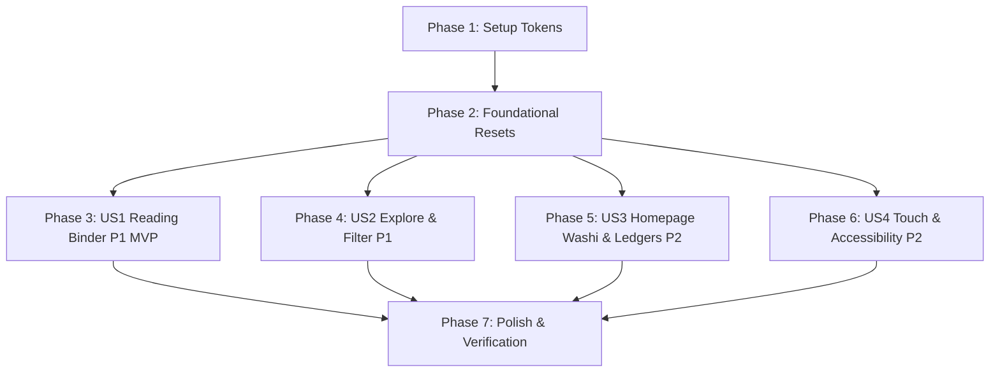

# Tasks: UI Visual Polish & Reading Comfort Enhancement

**Input**: Design documents from `specs/002-ui-visual-polish/`  
**Prerequisites**: `plan.md`, `spec.md`, `research.md`, `data-model.md`, `contracts/`, `quickstart.md`

## Organization
Tasks are strictly grouped by User Story in priority order. Each story is independently implementable and testable.

## Format: `- [ ] [TaskID] [P?] [Story?] Description with file path`

- **[P]**: Can run in parallel (different files, no dependencies)
- **[Story]**: Maps to user stories from `spec.md` (e.g. `[US1]`, `[US2]`, `[US3]`, `[US4]`)
- Every task includes an exact file path.

---

## Phase 1: Setup (Design Tokens & Color Palette)

**Purpose**: Ensure foundational CSS design tokens and Lucide icon mappings are available for all stories.

- [X] T001 [P] Verify and update color tokens (`--paper`, `--paper-cotton`, `--paper-cinnamon`, `--paper-butter`, `--paper-sage`, `--board-kraft`, `--code-bg`) in `src/styles/tokens.css`
- [X] T002 [P] Configure global transition and hard-shadow tokens (`--shadow-sm`, `--shadow-md`, `--shadow-lg`, `--ease-out`) in `src/styles/tokens.css`

---

## Phase 2: Foundational (Global Resets & Interactive Primitives)

**Purpose**: Core CSS primitives that MUST be in place before specific component refinements.

- [X] T003 [P] Implement unified physical button tactile styles (`.button-tactile`, hover lift `-2px`, active press `3px`) in `src/styles/base.css`
- [X] T004 [P] Implement dual-layer high-contrast `focus-visible` focus ring (`outline: 4px solid var(--black); box-shadow: 6px 6px 0 var(--teal);`) in `src/styles/base.css`
- [X] T005 [P] Implement global `prefers-reduced-motion: reduce` overrides disabling transforms and rotations in `src/styles/tokens.css`

**Checkpoint**: Foundation ready — user story implementations can now begin.

---

## Phase 3: User Story 1 - 沉浸式与高舒适度的文章长文阅读体验 (Priority: P1) 🎯 MVP

**Goal**: Transform public entry pages (`/entries/[slug]/`) into comfortable, eye-friendly "Reading Binder" layouts with optimal typography and engineering paper code blocks.

**Independent Test**: Visit `/entries/agent-oh-my-pi/` (or any entry), verify 960px max-width binder container, 65~75 char prose width, 1.8 line height, `#f0eae1` soft-wrapped code blocks, and working copy button with SVG checkmark feedback.

### Implementation for User Story 1

- [X] T006 [P] [US1] Refactor article container into 960px Reading Binder shell with drafting grid (`24px × 24px`) and 3.5px border in `src/styles/article.css`
- [X] T007 [P] [US1] Optimize prose typography rhythm (`line-height: 1.8`, `max-width: 720px`, paragraph margins, heading left stripes) in `src/styles/article.css`
- [X] T008 [P] [US1] Style engineering paper code blocks (`#f0eae1` background, `2.5px solid var(--black)`, soft-wrapping, zero horizontal scrollbar) in `src/styles/article.css`
- [X] T009 [US1] Enhance article header with kraft paper Summary Archive Box, type badge, and status stamp in `src/pages/entries/[slug].astro`
- [X] T010 [US1] Add client-side copy button script with SVG checkmark transition and `COPIED!` stamp feedback in `src/pages/entries/[slug].astro`
- [X] T011 [US1] Refactor related entries and backlinks deck with Lucide icons (`ArrowLeft`, `ExternalLink`, `Layers`) in `src/pages/entries/[slug].astro`

**Checkpoint**: User Story 1 complete — public article reading experience is fully polished and independently verifiable.

---

## Phase 4: User Story 2 - 灵敏触感与流畅的探索搜索交互 (Priority: P1)

**Goal**: Polish the Explore Island (`ExploreIsland.tsx`) with tactile filter chips, debounced search with match count, clear button, and accessible modal dialogs.

**Independent Test**: Navigate to the Explore section on the homepage, type search terms, click filter chips, verify instant tactile feedback and live count badge, and test modal dialog open/close with `Esc`.

### Implementation for User Story 2

- [X] T012 [P] [US2] Add search clear button, live specimen count badge (`FOUND // N SPECIMENS`), and Lucide SVG icons in `src/components/islands/ExploreIsland.tsx`
- [X] T013 [P] [US2] Enhance filter chip buttons with tactile active press state and type-specific paper badge colors in `src/components/islands/ExploreIsland.tsx`
- [X] T014 [US2] Polish card modal detail dialog with backdrop scroll lock, focus trap, and `Esc` key handling in `src/components/islands/ExploreIsland.tsx`
- [X] T015 [US2] Update Explore Island styling, empty-state paper illustration, and load-more button in `src/styles/home.css`

**Checkpoint**: User Story 2 complete — Explore search and filtering interactions are smooth and tactile.

---

## Phase 5: User Story 3 - 首页各区块的工坊手作与视觉节奏增强 (Priority: P2)

**Goal**: Introduce washi tape section dividers, specimen ledger table lists, and straighten-up paper cards to structure homepage visual rhythm.

**Independent Test**: Scroll through the homepage from Hero to Explore, verify washi tape striped dividers between sections, dot-leader ledger rows in Updates/Notes with hover slide, and straighten-up tilt animations on featured cards.

### Implementation for User Story 3

- [X] T016 [P] [US3] Implement washi tape striped section divider styles (`.washi-section-divider`) in `src/styles/home.css`
- [X] T017 [P] [US3] Add washi tape dividers between Hero, Featured, Updates, Notes, and Explore in `src/pages/index.astro`
- [X] T018 [P] [US3] Refactor Updates list into specimen ledger rows with dot-leaders and hover slide in `src/components/home/UpdatesSection.astro`
- [X] T019 [P] [US3] Refactor Notes list into specimen ledger rows with category badges in `src/components/home/NotesSection.astro`
- [X] T020 [P] [US3] Enhance Featured cards with playful micro-tilt (`rotate(-1.5deg)`) and hover straighten-up (`rotate(0deg)`) in `src/components/home/FeaturedSection.astro`
- [X] T021 [US3] Refine Hero section with tactile CTA buttons, eyebrow tape badge, and Lucide icons in `src/components/home/Hero.astro`

**Checkpoint**: User Story 3 complete — homepage rhythm and scrapbook workshop aesthetic fully realized.

---

## Phase 6: User Story 4 - 全站触控目标、键盘焦点与无障碍阅读友好性 (Priority: P2)

**Goal**: Guarantee 44px minimum touch targets, flawless responsive behavior across mobile/tablet/desktop, and tactile navigation controls.

**Independent Test**: Test site navigation on mobile viewport (360px ~ 768px), verify touch target compliance, test keyboard `Tab` traversal across all buttons and links, and verify Header/Footer layout.

### Implementation for User Story 4

- [X] T022 [P] [US4] Enforce 44px × 44px minimum clickable touch targets and mobile spacing guards in `src/styles/responsive.css`
- [X] T023 [P] [US4] Update SiteHeader with tactile breadcrumbs, back button, and Lucide navigation icons in `src/components/layout/SiteHeader.astro`
- [X] T024 [P] [US4] Update SiteFooter with tactile RSS link, status stamp, and Lucide icons in `src/components/layout/SiteFooter.astro`

**Checkpoint**: User Story 4 complete — site is fully accessible, mobile-ready, and keyboard-navigable.

---

## Phase 7: Polish & Verification

**Purpose**: Final end-to-end quality validation, cross-browser check, and static build audit.

- [X] T025 [P] Run Vitest test suite to verify no regressions in `tests/`
- [X] T026 [P] Run Astro production static build (`pnpm build`) to verify zero errors and clean output
- [X] T027 Execute validation scenarios in `specs/002-ui-visual-polish/quickstart.md`

---

## Dependencies & Execution Order

### User Story Dependencies
- **US1 (P1)**: Depends on Phase 1 & 2. Focuses on article pages.
- **US2 (P1)**: Depends on Phase 1 & 2. Focuses on Explore Island.
- **US3 (P2)**: Depends on Phase 1 & 2. Focuses on Homepage sections.
- **US4 (P2)**: Depends on Phase 1 & 2. Focuses on Layout & responsive styles.
- **Phase 7**: Runs after all user stories are implemented.

---

## Parallel Opportunities

- **Phase 1**: T001, T002 can run in parallel.
- **Phase 2**: T003, T004, T005 can run in parallel.
- **Phase 3 (US1)**: T006, T007, T008 can run in parallel before T009, T010, T011.
- **Phase 4 (US2)**: T012, T013 can run in parallel before T014, T015.
- **Phase 5 (US3)**: T016, T017, T018, T019, T020 can run in parallel.
- **Phase 6 (US4)**: T022, T023, T024 can run in parallel.

---

## Implementation Strategy

### MVP First (User Story 1)
1. Complete Phase 1 & Phase 2 (Foundations).
2. Complete Phase 3 (US1 - Reading Binder & Article Typography).
3. Validate `/entries/[slug]/` in browser.

### Incremental Rollout
1. Implement Phase 4 (US2 - Explore Island).
2. Implement Phase 5 (US3 - Homepage Rhythm & Washi Tapes).
3. Implement Phase 6 (US4 - Mobile Touch & Navigation).
4. Run Phase 7 verification (`pnpm test && pnpm build`).
